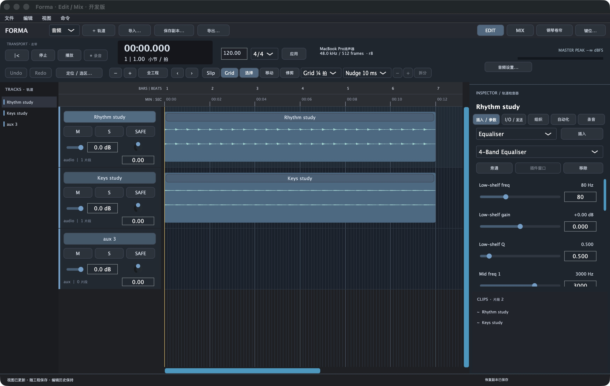

# Forma

**开源 macOS DAW：录音、编辑、MIDI 和混音，使用同一份可保存、可撤销的工程。**

当前开发版可以导入和播放真实音频，编辑片段和 MIDI、加载 AU/VST3、插入 EQ/压缩/混响/延迟、设置发送与路由、录写自动化，并导出 WAV。工程恢复、离线测量和导出复核保留在菜单中。具体边界见 [验证记录](docs/VERIFICATION.md)。

**正在重构原生 Edit / Mix 界面，尚未达到日常制作完整验收。** 当前依次推进 U＋P0（界面与基础编辑）、P1（录音/Comp）、P2（混音交付）、P3（Warp/MIDI CC）。AI 功能暂停扩充；既有 MCP 和分析入口保留。每级完成后由用户亲手试用。



实际 macOS 开发构建；波形来自本地原创合成 PCM，截图不代表实体录音或完整 U＋P0 验收。[真实 Mix 截图](.github/assets/forma-mix.png) · [CHANGELOG](CHANGELOG.md)。

## 快速开始

安装 Xcode Command Line Tools、CMake 和 Git 后：

```sh
git clone --recurse-submodules https://github.com/linnn-nb/forma.git
cd forma
cmake --preset release
cmake --build --preset release --target NativeDAW
open build-v2-tracktion/NativeDAW_artefacts/Release/Forma.app
```

使用「文件→导入音频」，直接在光标处创建轨道和片段，一次 Undo 撤销；空格播放/停止，T/R 水平缩放，Option＋方向键滚动，Cmd+= 切换 Edit/Mix。「键位…」可以即时编辑和导入导出快捷键，视图与键位随 `.tracktionedit` 保存。Edit 中可选择 Shuffle/Slip/Spot/Grid、选择/移动/修剪工具。Cmd+7 开音频 Smart Tool：上半部选区、下半部移动、边缘修剪、顶部圆点拖淡入淡出；松手一笔 Undo，淡化随工程保存。Grid 跟随 Tempo Map；Command 拖动临时取消吸附。逗号/句号或数字区 ± 执行 Nudge，Tab/Option+Tab 跳片段边界，Cmd+E 在光标拆分音频。选中音频 Clip 或轨道时间选区后，可用 Cmd+C/X/V/D 复制、剪切、粘贴、复制片段，Option+Cmd+V 粘回源位置；都能在「键位…」重映射。粘贴会替换目的区间，复制片段会保留重叠的现有内容；剪切保留原始媒体。剪贴板当前只存于本次打开的会话，工程重开后已提交的编辑仍保留，剪贴板需重新复制。MIDI/自动化剪贴板、MIDI 整片移动/修剪尚未接通；当前 Undo 历史只在本次打开期间保留。[当前计划](docs/UI_REBUILD_PLAN.md) / [下一步](docs/NEXT_STEPS.md)。

选区播放：CommandShiftK打开预卷/后卷设置（48k工程采样），CommandK切换；主标尺旗标拖动或双击，一笔Undo，保存重开并可改快捷键。关闭roll时仍按选区播放，Loop模式优先；录音预后卷尚未接通。结束采用Tracktion消息线程定时器，存在超出，不代表采样级截止。

时间线自动化：轨道头下拉选择音量、声像或实际插件参数，Control−切片段/音量，ControlCommand←/→切前后视图；选择画笔（CommandF10）绘制，移动工具拖点或双击加点，Option点删除、Backspace删除所选点。Selector仍拖时间范围。停止时松手一次事务，Undo/Redo、参数点与视图可保存重开；键位可改。当前每笔32个不同采样点、最多64操作，超限整体拒绝；曲线以256个SDK采样点显示，音频使用原生自动化。多点/自动化剪贴板、其他Pencil形状和高级模式仍未完成；最新桌面验收受锁屏阻塞。

钢琴卷帘：双击MIDI片段在Edit下方打开，拖分隔条调高度，⌘⌥M收起/恢复；空白拖绘音符，Shift点选或⌘A全选；拖动所选组、两缘改时长，⌘垂直拖或下方力度圆点改力度。⌘⌥0按当前网格/强度直接量化，⌘⌥↑/↓相对改力度，Delete/Backspace删所选，⌘Z/⌘⇧Z撤销/重做。键位可自定义；卷帘成组手势当前最多64音符，超出整笔拒绝。音符、实际力度、合成器状态及停靠高度、网格、滚动、Clip/Note选择可保存重开。时间选区链接、CC泳道及MIDI剪贴板仍未完成。

Edit列：在「视图→Edit Window Views」独立打开I/O、Inserts A–E、Sends A–E、Comments，默认⌘⌥1/2/3/4，可重映射。点真实插入槽打开效果器菜单/检查器，点指定发送槽进入该发送的路由控制；列开关随工程保存，不进入编辑Undo。Groups已接通独立Mix Mute/Solo，完整组属性和F–J仍未完成。

标尺：Edit左上「标尺」或「视图→Rulers」，独立显示七种标尺；Control+Option+0显示全部，Control+Option+9仅保留主标尺，Control+Option+1…7切换其余行（主标尺不可隐藏），可改键位。点时间基准名称切换Main及主计数器，Option点名称隐藏可选行。Loop打开后拖主标尺底部两端手柄改真实循环范围，⌘Z/⌘⇧Z撤销重做；编辑选区保留，视图与循环范围随工程保存。时间码仅24/25/30非丢帧从零显示，帧率位于标尺菜单，视频同步/起始偏移及完整Main相关单位切换尚未接通。

轨高/颜色：点Edit轨道头右侧「⋮」选高度或颜色，拖轨道头底边调高；Control+↑/↓调所选轨道，Control+Option+↑/↓按比例调全部。Mix同一菜单可改颜色，⌘Z/⌘⇧Z整笔撤销/重做；高度是视图设置，随工程保存、不占编辑Undo。Control+Option+C循环轨道颜色，所有命令可改键位。

波形显示：时间线右侧+/−/1，⌘⌥]/[放大缩小、⌃⌘⌥[恢复默认，可自定义键位。Zoomer中按Control左右拖连续水平缩放，上下拖所点音频轨波形高度；松手保存视图，Escape取消。显示幅度不改变声音或占据工程Undo，上一缩放恢复视口和各轨比例；MIDI/自动化视图的垂直缩放仍待实现。

Zoomer：F5循环Normal/Single，点击时间线居中放大、拖范围适配；Single完成后返回原工具。Option点击或⌘⌥E返回上一缩放，OptionF显示编辑选区，ControlCommand在标尺临时缩放；双击缩放工具显示全工程。视口和最多16条历史随工程保存，不占编辑Undo；支持水平缩放和上述音频显示尺度；其余高级缩放仍待实现。

Selector／Smart 选区：停止时F7点或拖，Shift改靠近的端点、Shift拖可跨锚点；滚动后Shift点击可建长选区。Command7的Smart上半部和空白轨共用规则。ShiftTab／OptionShiftTab扩展至所选轨道下一／上一实际片段边界，两个命令可改键；范围与插入点一笔CommandZ／ShiftCommandZ，保存重开保持。Escape取消不改变工程。独立Timeline/Edit链接及完整选区工作流仍待补。

Scrubber：工具栏Scrub／编辑菜单／⌘F9（可改键），按住左右拖动真实正反向试听；Selector（F7）可用Control拖动临时试听，Smart Tool只在选择热区响应。Command-Control按下细拖，显式Scrub也可用Command，速度为Forma定义的十分之一；Option可组合Shuttle。默认松手或Escape保留原工具、选区和插入点，空格恢复普通播放。编辑菜单开启“编辑插入点跟随 Scrub / Shuttle”（ControlOptionShiftF9，可改键）后，试听松手定位，再Shift试听松手建立两点选区；范围与插入点共同CommandZ／ShiftCommandZ，保存重开保持，全局偏好独立保存；Escape不提交。经过原FX与Aux/输出，同轨切点、空隙、重叠、四曲线淡化及Clip Gain可试听，支持mono/stereo混合采样率。按两条相邻音频轨边界可双轨试听，跨轨选区仅试听按时间线顺序的前两条音频轨；真实源合计最多8声道。保留原输出布局，声道删减/扩展会提示，额外输出不代表独立新媒体声道。单后台作业续读，两缓存槽各最多两轨合计32片段/8 MiB；缓存耗尽时源静音并保留游标，恢复从原位置继续，失败明确停止。Clip FX/路由自动化/伸缩等拒绝；双轨/8声道已做生产图PCM检查，实体多声道声卡、带报告延迟插件的双轨PDC、完整Scrubber仍待验收。

缩放预设：五个按钮或View→Zoom Presets，Control+1…5召回，Control+Shift+1…5/Shift点击保存当前水平缩放，右键存取。预设随工程保存，召回保持光标锚点；不保存完整工作区，也不改变原音频。

轨道备注：点Edit Comments列或Mix通道底部，或⌘⌥C打开多行编辑；⌘Return应用，Esc取消，留空清除，⌘Z/⌘⇧Z撤销重做。备注随工程保存，开关与快捷键可自定义；需停止播放，当前最多4096字符。

Groups：⌘G选择成员创建独立Mix组，侧栏点名称选成员、勾选框启用/禁用；成员Mute/Solo联动，⌘Z/⌘⇧Z整组撤销重做。⌘⇧G切换启用、⌘⌥G修改组，可重映射；组定义随工程保存。当前仅Mute/Solo，Folder/VCA层级和输出保持；完整编辑组、推子/Pan等联动尚未接通。

开发者可设置 `FORMA_SIGNING_IDENTITY` 为本机代码签名证书 SHA1；签名身份未配置的构建不保证麦克风授权跨构建保留。固定签名并非签名公证或正式发行。外部 MIDI、实体录音和持续可靠性仍有待实测。

## Build from source

Requirements: macOS 12 or newer, Xcode Command Line Tools, CMake, and Git with submodule support. The release preset fetches the pinned JUCE and JSON dependencies during configuration.

```sh
git clone --recurse-submodules https://github.com/linnn-nb/forma.git
cd forma
cmake --preset release
cmake --build --preset release
ctest --preset release --output-on-failure
```

The current development target produces `build-v2-tracktion/NativeDAW_artefacts/Release/Forma.app`. CoreAudio device tests use the available local audio device; a passing automated test suite does not replace microphone, MIDI-hardware, long-run or full GUI acceptance.

## Connect an external agent

The development application starts a local read-only MCP gateway. Choose the preview mode in the Command menu to let an agent propose edits; commit and external Undo requests display local confirmation cards. Configure your MCP client to launch the app’s `Contents/Helpers/forma-mcp` stdio bridge. The bridge connects to the running session and does not start another audio engine. See [MCP workflow and limits](docs/MCP_WORKFLOW.md).

## Project principles

- The DAW remains useful for recording, editing, mixing, saving and exporting without AI credentials or network access.
- AI and extensions read actual project facts and submit structured plans through the same command layer as the GUI.
- Edits are previewable and traceable. Undo applies to project transactions; irreversible file and recording operations are described honestly.
- Audio callbacks stay separate from network, model inference and user-interface work.
- The project does not claim `.ptx`, AAX hosting, proprietary hardware equivalence or compatibility that has not been implemented and tested.

## License

Forma Studio's original source is licensed under AGPL-3.0-only. Tracktion Engine, JUCE and other dependencies retain their own licenses and notices; see [LICENSE](LICENSE), [NOTICE](NOTICE.md), and the dependency manifests. This is an open-source copyleft project, not a closed-source commercial edition.

## 当前边界

Forma 仍是开发版。U＋P0 尚未完成：Clip/时间选区与三种工具、Slip/Grid、基础 Nudge、边界导航和真实音频 Clip 剪贴板已接通；剪贴板仅支持音频、会话内有效，MIDI/自动化联动未接通。音频Shuffle/Spot/Smart淡化、节拍器/预备拍/循环、Marker与独立MIDI成组编辑已有专项增量；停靠与统一音符选择、Groups/Edit Views和七种标尺已有增量；每轨高度/颜色入口与五个水平缩放预设已有增量；自动化轨道视图、完整Zoom Toggle及其余差距仍待补齐；Undo 跨工程重开恢复也尚未实现。P1–P3 按用户验收顺序推进。麦克风授权跨构建、外部 MIDI、Windows 和发行签名公证尚未验证或完成。

既有 Agent 网关和音频分析保留在菜单中，此阶段停止扩充。内部 CMake 目标与旧工程元数据仍使用 NativeDAW 名称，macOS 应用名为 Forma，Bundle ID 为 `org.forma.daw`。同时查看两个开发窗口时可用 `--no-mcp` 启动检查实例，避免占用正在使用的本地网关；普通启动方式不变。
